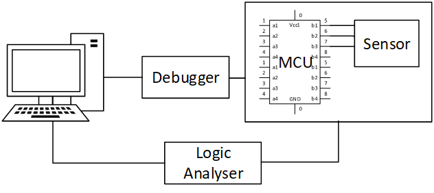

<div align="center">
  <a href="https://github.com/Omni-Embedded-Testing/Omni">
     
  </a>
  <h1 align="center">Omni</h1>
</div>

[](https://github.com/Omni-Embedded-Testing/Omni/actions/workflows/master_nightly.yml) [](https://opensource.org/licenses/MIT)

  <p align="left">
    A test framework for embedded systems that's open-source, offering full visibility and controllability of your target and its environment.
    <br />
    <br />
    <a href="https://github.com/othneildrew/Best-README-Template"><strong>Explore the docs »</strong></a>
    <br />
    <a href="https://github.com/othneildrew/Best-README-Template">View Demo</a>
    ·
    <a href="https://github.com/Omni-Embedded-Testing/Omni/issues/new?assignees=&labels=&projects=&template=bug_report.md&title=">Report Bug</a>
    ·
    <a href="https://github.com/Omni-Embedded-Testing/Omni/issues/new?assignees=&labels=&projects=&template=feature_request.md&title=">Request Feature</a>
    ·
    <a href="docs/Tutorials.md">Follow Tutorials</a>
  </p>


  

<!-- TABLE OF CONTENTS -->
<details>
  <summary>Table of Contents</summary>
  <ol>
    <li>
      <a href="#about-the-project">About The Project</a>
    </li>
    <li>
      <a href="#getting-started">Getting Started</a>
      <ul>
        <li><a href="#prerequisites">Prerequisites</a></li>
        <li><a href="#installation">Installation</a></li>
      </ul>
    </li>
    <li><a href="#usage">Usage</a></li>
    <li><a href="#roadmap">Roadmap</a></li>
    <li><a href="#contributing">Contributing</a></li>
    <li><a href="#license">License</a></li>
    <li><a href="#contact">Contact</a></li>
    <li><a href="#acknowledgments">Acknowledgments</a></li>
  </ol>
</details>

## About The Project
<!-- ABOUT THE PROJECT -->


Omni is a testing framework for embedded systems, It gives developers 
the ability to fully control both the target device and its environment. 
This control is achieved by interfacing with the device through the 
debugger and by manipulating environment conditions using 
laboratory equipment.

The framework allows for the integration of hardware tests directly with 
the development of new features. This means developers can write tests 
that are immediately run on a continuous testing server, enabling quick 
feedback on how the new features perform.

Omni supports the GDB debugger and a variety of laboratory devices, 
including power supplies, oscilloscopes, and logic analyzers, among 
others. This support ensures developers can set up a comprehensive 
testing environment tailored to the specific needs of their system.

As Omni decouples the test execution from the control of the 
laboratory equipment the *tests can be executed from within a docker* 
*container*.

<p align="right">(<a href="#readme-top">back to top</a>)</p>


<!-- GETTING STARTED -->
## Getting Started

### Prerequisites

* python3
* drivers for the laboratory devices (test specific)

### Installation

### Using pip
```cmd
  pip install omni-testing
```
### From sources

1. Clone the repo
   ```sh
   git clone https://github.com/Omni-Embedded-Testing/Omni
   ```
2. Build python package
   ```sh
   python3 setup.py sdist
   ```
2. Install python package
   ```sh
   pip install dist/Omni-0.0.1.tar.gz
   ```
*Substitute the package version by the current version beeing built.*

<p align="right">(<a href="#readme-top">back to top</a>)</p>


## Usage

Imagine a setup like the one below on your CI server or desktop:



This setup allows you to test the communication between your microcontroller unit (MCU) and a sensor. 
Here is an example of a test case using Omni and the Robot Framework to verify the interaction:

````
*** Test Cases ***
SPI CAPTURE TEMPERATURE SENSOR DATA
    [Documentation]    SPI CAPTURE TEMPERATURE SENSOR DATA
    Debuger.Load Test    my_application.elf
    Debuger.Breakpoint on Line And Go    TemperatureLogger.cpp  get_temperature();
    Logic.Set Timed Capture Mode    5
    Logic.Start Spi Capture
    Debuger.Continue Execution
    Logic.Wait Capture End
    Logic.Save Raw   TEMPERATURE_SENSOR.cap
    Logic.Export To Csv    TEMPERATURE_SENSOR.csv
    Logic.Verify Data     TEMPERATURE_SENSOR.csv
````

### Workflow Explanation:

1. **Flash Application**: Loads and flashes my_application.elf onto the target MCU.
2. **Set Breakpoint**: Sets a breakpoint at the line containing get_temperature(); in the file TemperatureLogger.cpp.
3. **Start SPI Capture**: Initiates a 5-second SPI bus capture to record temperature sensor data.
4. **Continue Execution**: Resumes the program execution in the debugger, similar to pressing the play button in an IDE.
5. **Wait for Capture End**: Holds the test until the SPI capture is complete.
6. **Save and Export Data**: Saves the raw capture data as TEMPERATURE_SENSOR.cap and exports it to a CSV file for easier analysis.
7. **Verify Logs**: Checks the CSV data file to ensure the capture data meets expected parameters.


_For more examples, please refer to the [Documentation](https://example.com)_

<p align="right">(<a href="#readme-top">back to top</a>)</p>

## Roadmap

- [ ] Tutorials documentation
- [ ] Omni as a CLI application
- [ ] Sigrok integration
- [ ] Usage behavior

See the [open issues](https://github.com/Embedded-Testing/Omni/issues) for a full list of proposed features (and known issues).

<p align="right">(<a href="#readme-top">back to top</a>)</p>


## Contributing

Contributions are what make the open source community such an amazing place to learn, inspire, and create. Any contributions you make are **greatly appreciated**.

If you have a suggestion that would make this better, please fork the repo and create a pull request. You can also simply open an issue with the tag "enhancement".
Don't forget to give the project a star! Thanks again!

1. Fork the Project
2. Create your Feature Branch (`git checkout -b feature/AmazingFeature`)
3. Commit your Changes (`git commit -m 'Add some AmazingFeature'`)
4. Push to the Branch (`git push origin feature/AmazingFeature`)
5. Open a Pull Request

<p align="right">(<a href="#readme-top">back to top</a>)</p>


<!-- LICENSE -->
## License

Distributed under the MIT License. See `LICENSE.txt` for more information.

<p align="right">(<a href="#readme-top">back to top</a>)</p>


## Contact

Erick Setubal Bacurau -  erickbacurau1989@gmail.com

Vitor Santiago - vitorsanti99@gmail.com

Project Link: [https://github.com/Embedded-Testing/Omni](https://github.com/Embedded-Testing/Omni)

<p align="right">(<a href="#readme-top">back to top</a>)</p>


## Acknowledgments

* Erick Setubal Bacurau - project creator
* Vitor Santiago - current project owner & mantainer

<p align="right">(<a href="#readme-top">back to top</a>)</p>
