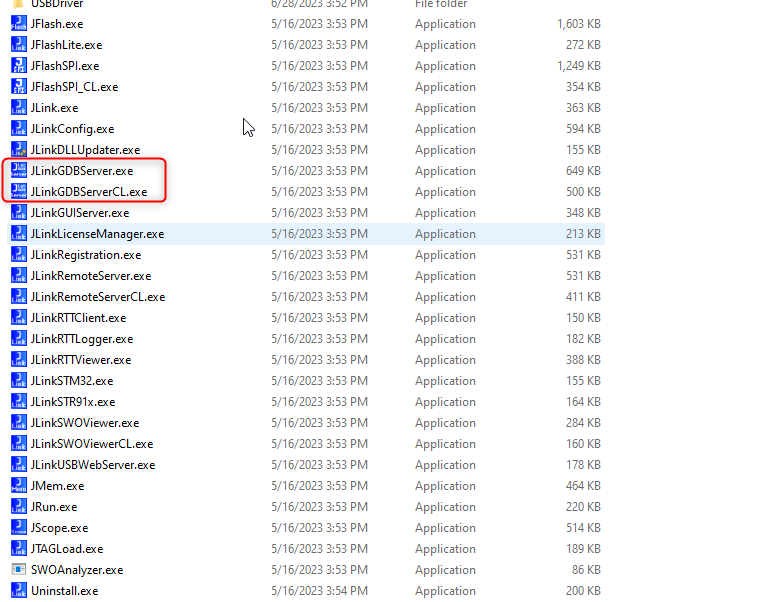
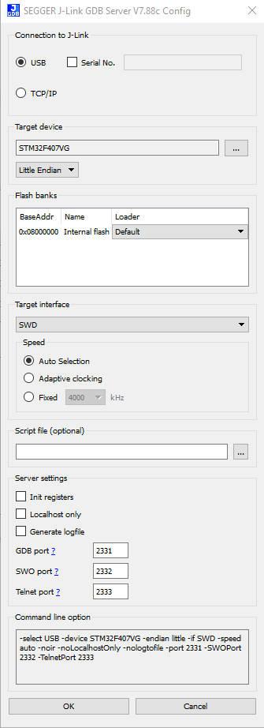
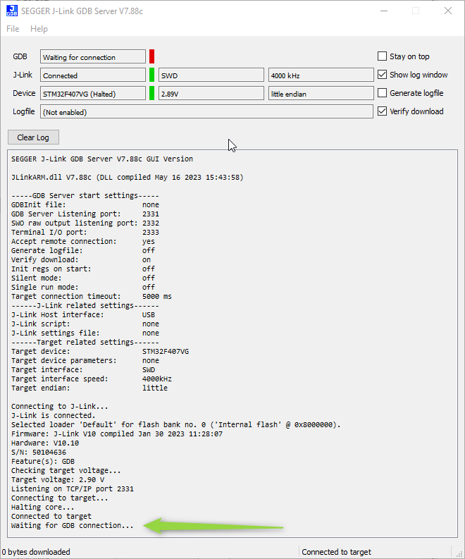
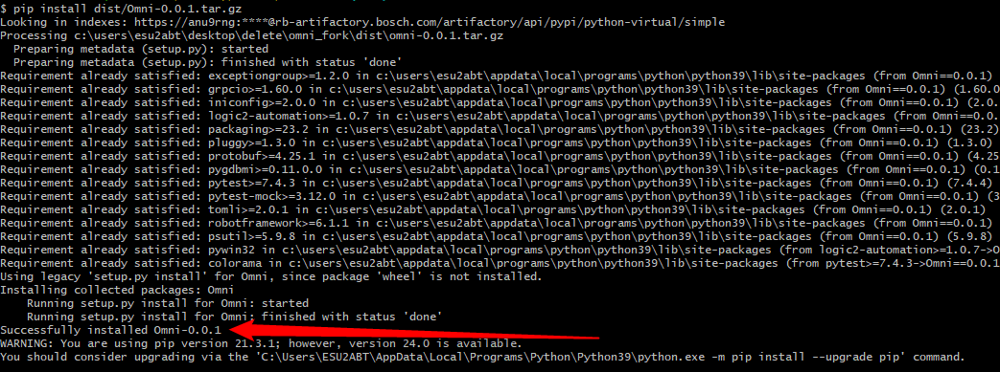
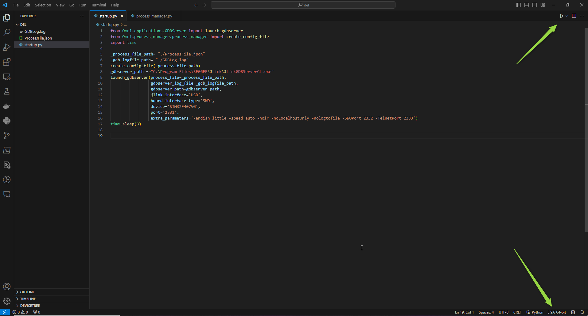

# Omni Tutorail  101: Process Manager launches & Shutsdown GDB Server

## Introduction
This tutorial is aimed at individuals who are new to Omni and seek to establish a foundational understanding of the tool. 
It is an introductory guide, focusing specifically on the essential tasks of launching and shutting down applications 
using the Process Manager.

This tutorial does not cover the entire testing process with Omni, only the start-up and shutdown stages are covered. 
Future tutorials within this series will cover the testing stage, offering more comprehensive insights and advanced techniques.

After completing this tutorial you will understand how to use the 

## Required Hardware & Software

**Jlink Debugger:** connected via USB to the target computer.
  


**Jlink Software:** The software necessary for operating the J-Link Debugger must be installed on your computer. Any version should work, but it is advisable to use the most actual one. [Downlaod](https://www.segger.com/downloads/jlink/)

**Target Device** The Jlink Debugger must be connected to some target microcontroller. Any microcontroller or microcontroller board with support for jlink is sufficient.

## Initial Test

The J-Link software package offers several tools, but for the purposes of this tutorial, our focus is on: `JLinkGDBServer.exe` and `JLinkGDBServerCL.exe`.



Both applications serve the same function, with the only distinction being their user interface. `JLinkGDBServer.exe` features a graphical interface, while `JLinkGDBServerCL.exe` operates through a command-line interface.

###  JLinkGDBServer Configuration

Begin by launching the JLinkGDBServer.exe application and configuring the parameters specific to your target:
* Connection to J-Link: USB.
* Target Device: Your target microcontroller.
* Target Interface: The interface facilitating communication between the J-Link debugger and your microcontroller.

Start the `JLinkGDBServer.exe` application and configure the parameters for your target. 
* Connection to JLink: USB
* Target Device: your target microcontroller
* Target Interface: the interface between the jlink debuger and your microcontroller

The provided image demonstrates the configuration settings tailored for the STM32F407G-DISC1 board from STM.



After confirming your configuration, you should observe the following image. The text *Waiting for GDB Connection* indicates successful communication between your computer and the board.



If you encounter any result other than what is in the image, You need to verify all components of the system for proper functioning before advancing with the tutorial.

## Omni Installation

### From Sources
To begin the Omni installation process, follow these steps:

1. Clone the repository from the [Omni](https://github.com/Embedded-Testing/Omni). 
2.  Open a terminal in the root folder of the repository and execute the following commands:
```python
python setup.py sdist
pip install dist/Omni-0.0.1.tar.gz
```
3.  Verify successful instalation

Upon successful installation, you should receive the message: `Successfully installed Omni-0.0.1`.



### From pypi

*TDB*

## Start Up File Creation

Create a Python script named startup.py in any folder on your computer. Then, add the provided content:

```py
from Omni.applications.GDBServer import launch_gdbserver
from Omni.process_manager.process_manager import create_config_file
import time

_process_file_path= "./ProcessFile.json"
_gdb_logfile_path= "./GDBLog.log"
create_config_file(_process_file_path)
gdbserver_path =r"C:\Program Files\SEGGER\JLink\JLinkGDBServerCL.exe"
launch_gdbserver(process_file=_process_file_path,
                 gdbserver_log_file=_gdb_logfile_path,
                 gdbserver_path=gdbserver_path,
                 jlink_interface='USB',
                 board_interface_type='SWD',
                 device='STM32F407VG',
                 port='2331')
time.sleep(3)
```
Explanation of files and functions:
* **ProcessFile.json**: This file contains metadata about the processes running on the host computer. In the case of this tutorial only `JLinkGDBServerCL`.
* **GDBLog.log**: This file stores the standard output and standard error of the JLinkGDBServerCL process.
* **create_config_file(_process_file_path)**: This function creates an empty process file. If the process file already exists, it will raise an exception. If you need to execute the script multiple times, delete the process file beforehand.
* **launch_gdbserver()**: This function starts the JLinkGDBServerCL. The parameters process_file, gdbserver_log_file, gdbserver_path, jlink_interface, board_interface_type, device, and port are mandatory and must be defined by the user. Additionally, the function accepts an optional parameter extra_parameters, which is used to pass non-mandatory parameters. Refer to the J-Link manual or the JLinkGDBServer.exe application for a better understanding of the extra parameters. Note that these parameters are displayed under "Command line options" in the user interface.

Example with extra parameters:
```py
launch_gdbserver(process_file=_process_file_path,
                 gdbserver_log_file=_gdb_logfile_path,
                 gdbserver_path=gdbserver_path,
                 jlink_interface='USB',
                 board_interface_type='SWD',
                 device='STM32F407VG',
                 port='2331',
                 extra_parameters='-endian little -speed auto -noir -noLocalhostOnly -nologtofile -SWOPort 2332 -TelnetPort 2333')
```

To understand better the extra parameters pelase refer to the Jlink manual or to the `JLinkGDBServer.exe` application. Note that the extra parameters are displayed in under *Command line option* in the user interface.

## Execute the startup.py file

Running the startup.py File

To execute the startup.py file, follow these steps:
1. Open a command line interface.
2. Navigate to the directory containing the startup.py file.
3. Enter the following command:

```
python -m .\startup.py
```

If you encounter an error stating that Omni is not recognized, it may be due to multiple versions of Python installed on your system. In such cases, it is recommended to execute the script using Visual Studio Code (VS Code).

To do this:
1. Open the startup.py file in VS Code.
2. At the bottom of the VS Code window, select your Python interpreter.
3. Finally, click the play button at the top of the VS Code window to execute the script.




## Analyse the Files and the Process

The process file stores crucial metadata about the processes initiated by Omni. This metadata serves multiple purposes, including process termination during the shutdown phase and aiding in debugging when necessary.

Here's an example of the process file structure:

Example of process file
```
[
    {
        "application": "JLinkGDBServerCL",
        "pid": "26020",
        "log_file": "./GDBLog.log",
        "process_call": "C:\\Program Files\\SEGGER\\JLink\\JLinkGDBServerCL.exe -select USB -device STM32F407VG -if SWD -port 2331",
        "start_time": "13:31:36",
        "port": "2331",
        "pgrep_string": "JLinkGDBServerCL"
    }
]
```

The GDBlog contains all the communication with the `JLinkGDBServer.exe`. You can see the output:

```
SEGGER J-Link GDB Server V7.88c Command Line Version

JLinkARM.dll V7.88c (DLL compiled May 16 2023 15:43:58)

Command line: -select USB -device STM32F407VG -if SWD -port 2331 -endian little -speed auto -noir -noLocalhostOnly -nologtofile -SWOPort 2332 -TelnetPort 2333
-----GDB Server start settings-----
GDBInit file:                  none
GDB Server Listening port:     2331
SWO raw output listening port: 2332
Terminal I/O port:             2333
Accept remote connection:      yes
Generate logfile:              off
Verify download:               off
Init regs on start:            off
Silent mode:                   off
Single run mode:               off
Target connection timeout:     0 ms
------J-Link related settings------
J-Link Host interface:         USB
J-Link script:                 none
J-Link settings file:          none
------Target related settings------
Target device:                 STM32F407VG
Target device parameters:      none
Target interface:              SWD
Target interface speed:        auto
Target endian:                 little

Connecting to J-Link...
J-Link is connected.
Firmware: J-Link V10 compiled Jan 30 2023 11:28:07
Hardware: V10.10
S/N: 50104636
Feature(s): GDB
Checking target voltage...
Target voltage: 2.86 V
Listening on TCP/IP port 2331
Connecting to target...
Connected to target
Waiting for GDB connection...
```

This output confirms the successful initiation of the process, with port 2331 being open. Subsequently, a GDB session can be established to control the debugger through this connection. When listing running processes on your machine, you'll observe that JLinkGDBServer.exe is active, with the same process ID (PID) as listed in the ./ProcessFile.json.

**Before proceding with the tutorial** 

It's essential to note that `JLinkGDBServer.exe` is a daemon process in the background. Therefore, before proceeding, it must be manually terminated. You can accomplish this using PowerShell or the Task Manager.


## Shutdown process extension

To incorporate shutdown functionality, insert the following lines into the startup.py file:

```py
from Omni.applications.GDBServer import launch_gdbserver
from Omni.process_manager.process_manager import create_config_file,close_applications
import time

_process_file_path= "./ProcessFile.json"
_gdb_logfile_path= "./GDBLog.log"
create_config_file(_process_file_path)
gdbserver_path =r"C:\Program Files\SEGGER\JLink\JLinkGDBServerCL.exe"
launch_gdbserver(process_file=_process_file_path,
                 gdbserver_log_file=_gdb_logfile_path,
                 gdbserver_path=gdbserver_path,
                 jlink_interface='USB',
                 board_interface_type='SWD',
                 device='STM32F407VG',
                 port='2331'
                 )
time.sleep(3)
close_applications(_process_file_path)
```

The `close_applications(_process_file_path)`  function call initiates the shutdown process by 
terminating all processes registered in the `./ProcessFile.json` file.

# Disclaimer

**Please Note: This tutorial incorporates functionality that is subject to change.**


* The startup.py script will undergo transformation into a JSON file format, which will serve as a list of all processes to be initiated along with their respective command-line arguments.
* Omni will be a command line tool. You will be able make a call similar to Omni --start ./processfile.json
* The process file will be enhanced to include additional information about each process, such as details regarding whether it terminated gracefully or forcefully, application versions, and other relevant data.
* Additionally, there are plans to introduce a deploy script capable of automatically downloading and installing all required software onto the host computer. This script will offer the flexibility to select desired software versions for installation.


# Next Steps

Follow the **Omni Tutorail 102** once it is released

# Feedback

I would love to receive feedback from you please point in the Pull Request if you had any difficulties with the tutorial.